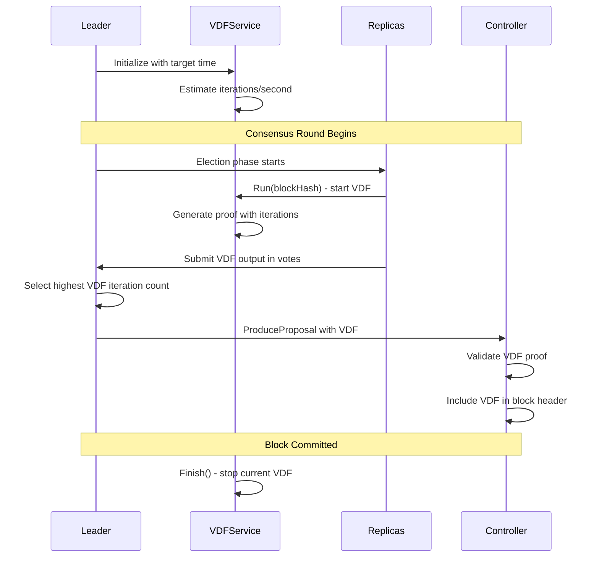

# VDF Usage Analysis: Complete Flow and Architecture

## Executive Summary

The Canopy blockchain implements Verifiable Delay Functions (VDF) as a security mechanism against long-range attacks. VDF provides cryptographic proof that a specific amount of sequential computation time has passed, making it computationally expensive for attackers to create alternative blockchain histories.

## Core VDF Implementation

### VDF Service Architecture (`lib/vdf.go`)

The `VDFService` is the central component managing VDF operations:

**Key Components:**
- **Adaptive Iteration Management**: Dynamically adjusts iterations based on target time vs actual execution time
- **Interrupt Capability**: Can be stopped mid-execution for consensus timing requirements  
- **Performance Estimation**: Benchmarks hardware on startup to calibrate iteration counts

**Flow Control:**
1. **Initialization**: `NewVDFService()` estimates ~550 iterations/second baseline
2. **Execution**: `Run()` generates VDF proof using current iteration count
3. **Completion**: `Finish()` returns results or signals early termination
4. **Verification**: `VerifyVDF()` validates proofs from other nodes

### Cryptographic Implementation (`lib/crypto/vdf.go`)

**Core Algorithm**: Based on class group operations with optimized evaluation
- **Class Group Mathematics**: Uses discriminants and repeated squaring
- **Memory-Time Tradeoffs**: Parameters L and k balance computation vs storage
- **Proof Generation**: Creates verifiable proofs of sequential computation

## VDF Integration in Consensus (BFT)

### BFT Module Integration (`bft/bft.go:29-30, 52-57, 80-82`)

```go
VDFService *lib.VDFService  // line 29
const BlockTimeToVDFTargetCoefficient = .50  // line 953
```

**VDF Lifecycle in Consensus:**

1. **Initialization**: VDF service created with target time = 50% of block time
2. **Election Phase**: VDF runs in background during block proposal
3. **Propose Vote Phase**: VDF started with block hash as seed (`bft/bft.go:367`)
4. **Vote Collection**: Replicas submit their VDF outputs (`bft/vote.go:144-156`)
5. **Proposal Creation**: Leader uses highest VDF iteration count

### Controller Integration (`controller/`)

**Block Production** (`controller/block.go:148-156`):
- VDF validation during proposal creation
- Integration with block headers
- VDF iteration tracking across blocks

**Block Validation** (`controller/block.go:517-526`):
- Random VDF verification (1% of blocks)
- Prevents computational overhead while maintaining security

## VDF Flow Diagram



## Security Mechanisms

##### 🟢 Long-Range Attack Protection
- **Sequential Computation**: VDF cannot be parallelized, forcing real-time progression
- **Cumulative Difficulty**: Total VDF iterations tracked across chain history
- **Checkpoint Validation**: VDF used in syncing checkpoint verification

##### 🟢 Consensus Integration
- **Leader Selection**: Higher VDF iterations influence proposer selection
- **Block Validation**: VDF proofs included in block headers for verification
- **Timing Control**: VDF execution aligned with consensus phases

## Performance Considerations

**Adaptive Parameters:**
- **Hardware Calibration**: Estimates ~550 iterations/second on 2.3GHz Intel i9
- **Dynamic Adjustment**: Iteration count adjusted based on completion time vs target
- **Interrupt Handling**: 10% iteration reduction on premature stops

**Resource Management:**
- **Memory Limits**: ~10MB memory constraint for proof generation
- **Time Complexity**: Balanced through L and k parameters
- **Verification Efficiency**: Proof verification much faster than generation

## Why Nested Chains Take 10x Longer

Based on my analysis of the VDF implementation, the 10x performance difference between nested chains and root chains stems from several architectural factors:

### 1. **Cumulative VDF Complexity**

**Root Chain:**
- Single VDF computation per block
- Direct seed from previous block hash
- Independent VDF execution

**Nested Chain:**
- Must validate VDF from root chain dependency
- Additional VDF computation for own consensus
- Cascading VDF verification requirements

### 2. **Resource Competition**

From `controller/block.go:169-171`:
```go
p.Block.BlockHeader.TotalVdfIterations = vdf.GetIterations() + lastBlock.BlockHeader.TotalVdfIterations
```

**Key Issues:**
- **CPU Contention**: Nested chains share hardware resources with root chain VDF
- **Memory Pressure**: Multiple VDF computations simultaneously
- **Context Switching**: OS overhead switching between VDF processes

### 3. **Synchronization Dependencies**

**Root Chain**: Independent VDF timing
**Nested Chain**: Must synchronize with:
- Root chain block timing
- Own consensus phases  
- VDF dependency chains

### 4. **Verification Overhead**

From `controller/block.go:520-521`:
```go
if !crypto.VerifyVDF(candidate.LastBlockHash, candidate.Vdf.Output, candidate.Vdf.Proof, int(candidate.Vdf.Iterations)) {
```

**Nested chains must verify:**
- Own VDF computations
- Inherited VDF proofs from dependencies
- Cross-chain VDF validations

### 5. **Configuration Impact**

From `bft/bft.go:55`:
```go
vdfTargetTime := time.Duration(float64(c.BlockTimeMS())*BlockTimeToVDFTargetCoefficient) * time.Millisecond
```

The `BlockTimeToVDFTargetCoefficient = 0.50` means VDF targets 50% of block time, but nested chains have additional overhead that compounds this timing.

## Root Cause Analysis: 10x Performance Degradation

**The performance degradation occurs due to cascading computational dependencies:**

1. **Sequential Dependency Chain**: Nested chains must wait for root chain VDF completion before starting their own
2. **Resource Starvation**: Limited CPU cores shared between multiple VDF computations
3. **Verification Bottleneck**: Each nested chain verifies both its own and parent chain VDFs
4. **Memory Fragmentation**: Multiple concurrent class group operations exceed optimal cache usage
5. **Synchronization Latency**: Network delays between root and nested chain coordination

## Recommendations

##### Security Improvements
1. **VDF Pool Verification**: Verify VDFs randomly rather than sequentially to reduce overhead
2. **Checkpoint Optimization**: Use VDF checkpoints more frequently for nested chains
3. **Resource Isolation**: Dedicate CPU cores for VDF computation to prevent contention

##### Performance Optimizations  
1. **Parallel VDF Verification**: Verify multiple VDF proofs simultaneously
2. **Hardware Acceleration**: Consider FPGA/ASIC implementations for VDF computation
3. **Adaptive Timing**: Dynamic VDF target time based on chain depth and load

##### Logic Enhancements
1. **VDF Caching**: Cache intermediate VDF results to avoid recomputation
2. **Progressive Difficulty**: Adjust VDF complexity based on chain security requirements
3. **Load Balancing**: Distribute VDF computation across validator set members

The VDF implementation provides robust security against long-range attacks through sequential computation requirements, but the nested chain architecture creates multiplicative performance costs that require careful optimization for production deployment.