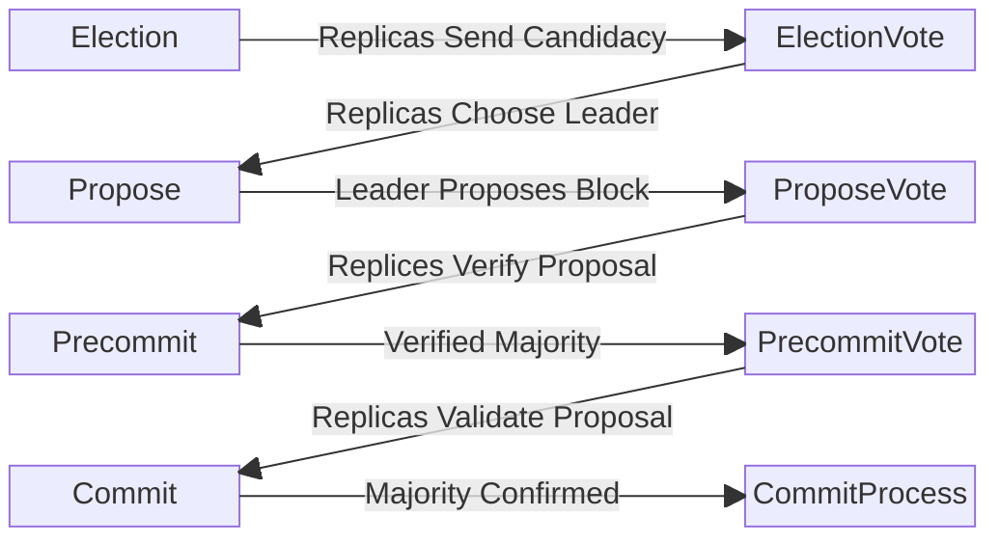

# Documentation for `bft.go`

# Description

## `bft` Type

The `bft` type is a comprehensive structure that encapsulates the state and core logic of the NestBFT consensus algorithm. It is responsible for driving the consensus process forward through the core consensus phases, ensuring trusted and timely operation of the Canopy blockchain.

- **Consensus and View Management**:
  - Manages the current consensus phase for each replica. Tracks the current view from the perspective of the replica.
  - Through p2p communication it coordinates parallel phase progression between other participating replicas.

- **Leader Election**:
  - Employs Verifiable Random Functions (VRF) and a Sortition proces to ensure fair and unbiased leader selection.
  - The leader is elected based on a combination of randomness and voting power.


- **Block and Result Management**:
  - Manages the current blockchain block and its related data.
  - Guarantees proper proposal crafting and verification per consensus rules whilst documenting consensus results and slashing conditions.

- **Vote and Proposal Management**:
  - Records the votes received from the validators and the proposals originating from the leader.

- **Security Assurance**:
  - Employs security mitigations for griding and long chain attacks.
  - Enforces slashing and rewarding mechanisms.
  - Validates all proposals and votes.

## Consensus Phase Overview

The consensus process is broken down into 8 core phases and 2 recovery phases.
Each phase represents the smallest unit of the concensus process. Each round
consists of multiple phases, and each height may consist of multiple rounds.
These phases are executed sequentially and upon successful completion achieve
consensus on the next block.

At the beginning of each new block height the round is reset to 0 and restarts
consensus at the Election phase. If the a round of consensus does not succeed,
recovery phases are initiated in order to continue consensus.

### Phase Summaries

- **Election:**
  - Each replica runs a Verifiable Random Function (VRF); if selected as a candidate, the replica sends its VRF output to the other replicas.

- **ElectionVote:**
  - Each replica sends ELECTION votes (signature) for the leader based on the lowest VRF value. If no candidates exist, the process falls back to a stake-weighted-pseudorandom selection.

- **Propose:**
  - The leader collects ELECTION.VOTES from +2/3 of the replicas, each including the lock, evidence, and signature from the sender. If a valid lock exists for the current height, the leader uses that block as the proposal block. If no valid lock is found, the leader creates a new block to extend the blockchain.

- **ProposeVote:**
  - Each replica validates the PROPOSE message by verifying the aggregate signature, applying the proposal block against their state machine, and checking the header and results against what they produced. If valid, the replica sends a vote (signature) to the leader.

- **Precommit:**
  - The leader collects PROPOSE VOTES from +2/3 of the replicas, each including a signature from the sender. The leader sends a PRECOMMIT message attaching +2/3 signatures from the PROPOSE VOTE messages.

- **PrecommitVote:**
  - Each replica validates the PRECOMMIT message by verifying the aggregate signature. If valid, the replica sends a vote to the leader.

- **Commit:**
  - The leader collects PRECOMMIT VOTES from +2/3 of the replicas, each including a signature from the sender. The leader sends a COMMIT message attaching +2/3 signatures from the PRECOMMIT VOTE messages.

- **CommitProcess:**
  - Each replica validates the COMMIT message by verifying the aggregate signature. If valid, the replica commits the block to finality and resets the BFT for the next height.

The two recovery phases address situations where errors cause a premature exit from a round:

- **Round Interrupt**:
  - In this phase concensus is halted and reset. Each replica shares its current View with all other replicas. This allows replicas to synchronize in the Pacemaker phase.

- **Pacemaker**:
  - This phase synchronizes each replica to the highest round that a super-majority has observed, allowing the consensus process to restart with the Election phase.

# Key Concepts


#### View

The `View` field within the `BFT` struct is a component tracking the current
period of the consensus process, defined by `Height`, `Round`, and `Phase`.

The `View` aids in synchronizing validators by providing a consistent reference
point for the current state of the blockchain. It ensures that all validators
are aligned regarding the block height, round, and phase they are operating in.
This alignment allows validators to correctly interpret proposals, cast votes,
and validate the results of the consensus process.

The `View` is included with every message sent between nodes and is required
during the recovery phases, where it is used to synchronize all replicas to
highest round seen by the super-majority of nodes.

#### Super-Majority

A super-majority refers to a threshold of agreement among the participating
replicas that is greater than a simple majority. Specifically, it requires more
than two-thirds (+2/3) of the voting power or votes from the replicas to agree
on a proposal or vote to be considered in consensus.

The super-majority threshold is applied in various phases of the consensus
process, such as during the ELECTION, PROPOSE, PRECOMMIT, and COMMIT phases,
where the leader collects votes from +2/3 of the replicas to justify consensus
on an election or proposal. This mechanism ensures that the system can function
effectively despite potential faulty or Byzantine nodes.

#### Proposal Locks

Once a proposal is supported by a quorum certificate, replicas will `lock` onto
the proposal. If consensus is not achieved in a specific round, the locked
proposal is preserved for future rounds. This ensures that even if the current
round does not reach consensus, the proposal is not discarded. Instead, it
remains a valid proposal for subsequent rounds. The leader in the next round can
propose this same proposal again, as it already has quorum support.

#### Quorum Certificates

Replicas use the Quorum Certificate (QC) to share important information with
other replicas. This information may include the current view of a replica, a
vote, or a super-majority consensus that validates an action.

Quorum Certificates (QCs) demonstrate that a specified majority of replicas (at
least two-thirds) have verified and agreed on a particular aspect of the
consensus process. These certificates confirm that consensus has been reached
without requiring constant direct communication among all replicas.

# Core Phases

## Election Phase

The election phase utilizes a sortition process in conjunction with a Verifiable
Random Function (VRF) to ensure the selection of leaders is fair, uniform, and
unpredictable. This process relies on unique and non-manipulatable inputs of
seed data, which are crucial in resisting manipulation and providing a robust
defense against potential biases. The use of VRF ensures that the selection
process is both random and publically verifiable.

Validators create a digital signature on the sortition seed data using their
private key. The integer value of this signature is the random component in the
election process. This combined with their voting power, determines their
candidacy. The stake of a validator influences this process, as a higher stake
increases the probability of becoming a candidate. This stake-weighted method
ensures that validators with larger contributions to the network have a greater
likelihood of selection, aligning the incentives of network participants with
the security and integrity of the blockchain.

#### Sortition Seed Data

The integrity of the sortition seed data is paramount, as any manipulation could
lead to predictable and biased leader selection. By ensuring that the seed data
remains secure and non-manipulatable, NestBFT fosters an environment where
leadership is assigned fairly, maintaining unpredictability and fairness in the
network.

Two seed data fields in particular provide essential reliability and security:

- **Round**: The inclusion of the round field in the sortition data helps ensure
  that the same leader is not selected in consecutive rounds. This is achieved
  because the Verifiable Random Function (VRF) output signature changes with
  each round, reducing the probability of repeated leader selection. This
  mechanism helps mitigate risks associated with a potentially malicious or
  faulty leader.

- **Last Proposer Addresses**: NestBFT distinguishes itself from other
  protocols by utilizing the LastProposerAddresses field within its sortition
  seed data. This approach avoids reliance on manipulable inputs, such as the
  last block hash, which are susceptible to bias and grinding attacks. By
  eliminating these vulnerabilities, NestBFT ensures a fairer and less
  predictable leader selection process.

## Election Vote Phase

In the ELECTION VOTE phase, each replica reviews messages from candidates, which
include a Verifiable Random Function (VRF) output. This cryptographic function
generates a publicly verifiable random output. The replicas select the candidate
with the lowest VRF output as the leader, promoting a fair selection process.

If no candidate messages are received, the process defaults to a
stake-weighted-pseudorandom selection to ensure a leader is chosen.

Once a leader is determined, each replica sends a signed ELECTION vote to the
selected leader. In the following phase, the leader aggregates these votes. If
they receive votes from more than two-thirds of the replicas, they can justify
proposing a new block. This vote aggregation indicates consensus among the
replicas.

## Propose Phase

During the PROPOSE phase of the NestBFT consensus algorithm, the leader is
responsible for producing a new block proposal. Here are the steps involved in
this phase:

1. **Collecting Election Votes**: The leader gathers election votes from more
   than two-thirds (+2/3) of the replicas. This serves as proof of the leader's
   qualification to propose a block.

2. **Proposal Block Selection**:
   - If a valid lock exists for the current height, the leader uses the locked
     block as the proposal block. This ensures that the proposal is based on a
     previously agreed-upon state, enhancing the stability and reliability of
     the consensus process.
   - If no valid lock is found, the leader creates a new block to extend the
     blockchain. This new block is constructed with the maximum number of
     transactions available in the mempool, ensuring efficient use of network
     resources.

3. **Creating the Proposal**: The proposal consists of the new proposed block
   and the associated results, which include the reward and slash recipients. A
   block contains the transactions to be processed, and the proposal is backed
   by the signatures from the election votes, confirming the leader's
   legitimacy.

4. **Distribution of Proposal**: The leader sends the newly created proposal
   (block, results, evidence) to all validators. The proposal is justified by
   attaching the aggregate signatures from more than two-thirds (+2/3) of the
   election votes, confirming the leader's legitimacy.

## Propose Vote Phase

In the NestBFT consensus algorithm, the PROPOSE VOTE phase involves several
critical steps where the replicas (nodes) validate the proposal put forward by
the leader. Each replica follows a systematic approach to ensure the proposal's
validity:

1. **Proposal Validation**: Each replica receives the PROPOSE message from the
   leader and must validate it by checking the aggregate signature. This step
   confirms that the leader's role is justified by having received votes from at
   least 2/3 of the replicas.

2. **Proposal Unlock**: If a valid lock exists for the current height and meets
   the safe node predicate, the leader uses that block as the proposed block. If
   no valid lock is found, the leader creates a new proposal.

3. **State Application**: Replicas apply the proposal block against their
   individual state machines, ensuring consistency and accuracy with their own
   data and expected outcomes.

4. **Header and Results Verification**: Each replica checks the header and the
   results of the proposal against what they themselves have produced. This
   ensures there's no discrepancy in the transactions and resulting state
   machine updates.

5. **Signature Voting**: If the proposal is deemed valid, the replica sends a
   signature to the leader, effectively casting their vote. This vote endorses
   the validity of the proposal and confirms the approval of the replica in its
   execution.

## Precommit Phase

In the PRECOMMIT phase of the NestBFT consensus algorithm, the leader collects
PROPOSE VOTES from more than two-thirds of the replicas. The aim of this phase
is to confirm that the proposed block has the backing of a super-majority.

During this phase, the leader compiles evidence that the proposed block is
broadly accepted by ensuring that over two-thirds of the quorum agree on the
proposal's validity.

## Precommit Vote Phase

In the PRECOMMIT-VOTE phase of the NestBFT consensus algorithm, each replica is
tasked with verifying the PRECOMMIT message. This involves ensuring that the
proposal comes from the expected proposer and that it is the expected proposal.
The replicas achieve this by validating the aggregate signature contained within
the PRECOMMIT message. If the aggregate signature is valid each replica will
`lock` the proposal.

Once the proposal is verified, each participating replica sends a vote back to
the proposer. This vote signals that the replica has verified and agrees with
the proposal, expressing its support for the super-majority needed to advance to
the next phase of the consensus process. The votes collected during this phase
allow the leader justify that the required super-majority quorum believes the
proposal is valid and ready to be committed to the blockchain.

## Commit Phase

During the COMMIT phase of the NestBFT consensus algorithm, the leader collects
PRECOMMIT votes from more than two-thirds (i.e., +2/3) of the replicas. Each of
these votes includes a signature from the sender, which the leader then uses to
construct a COMMIT message. This message attaches the +2/3 signatures from the
PRECOMMIT VOTE messages, which serves as justification that a super-majority of
the quorum believes the proposal is valid.

Once the leader has prepared the COMMIT message, it is sent to all validators.
Upon receiving the COMMIT message, each replica validates it by verifying the
aggregate signature provided. If the validation is successful, each replica will
then commit the block to finality. Following this, the BFT setup is reset in
preparation for reaching consensus on the next block height. This phase
solidifies the proposed block, ensuring that it becomes a permanent part of the
blockchain.

## Commit Process Phase

The COMMIT PROCESS phase in the NestBFT consensus algorithm involves the
validation of the COMMIT message. Each replica verifies the aggregate signature
included in the COMMIT message to ensure that it is from the expected proposer
and that the proposal is valid. Once the aggregate signature is verified, the
proposal signifies that +2/3 of the quorum agrees that a super-majority believes
the proposal is valid.

Upon successful verification, the block is gossiped throughout the network and
committed to the local chain. This step finalizes the block within the chain at
the current height. Following the commitment, the replicas then reset the BFT
process for the next block height, enabling the continuation of the consensus
process for subsequent blocks.

# Recovery Phases

## ROUND INTERRUPT

The ROUND INTERRUPT phase occurs in response to a failure in the BFT cycle,
resulting in a premature exit from a round. This leads to the initiation of a
new round and an extension of the sleep time between phases. This extended sleep
time aims to mitigate any async network issues that may have arisen during the
current round.

Furthermore, this round sends a pacemaker message to all other replicas. This
message includes a Quorum Certificate that contains the current View's header,
allow the pacemaker round to synchronize all replicas.

## Pacemaker

After the ROUND INTERRUPT phase, the PACEMAKER phase begins. In this phase, each
replica evaluates the views exchanged during the previous phase to determine the
highest round observed by a super-majority. The replicas then transition to this
round. The PACEMAKER phase reinitializes the consensus process and synchronizes
the replicas, ensuring they operate within the same round recognized by a
super-majority.

Once the Pacemaker phase is complete, the consensus process restarts at the
Election phase, electing a new leader and potentially unlocking a proposal that
was locked in this round.

# Phase Times and Total Block Time

In NestBFT, block times are managed by setting the duration for each phase in the `config.json` file. The initial phase time configurations are as follows:

```json
{
  "electionTimeoutMS": 2000,
  "electionVoteTimeoutMS": 2000,
  "proposeTimeoutMS": 3000,
  "proposeVoteTimeoutMS": 3000,
  "precommitTimeoutMS": 2000,
  "precommitVoteTimeoutMS": 2000,
  "commitTimeoutMS": 2000,
  "commitProcessMS": 3000
}
```

Each phase duration can be modified to suit the application's requirements. The
total block time is the aggregate of all phase durations. To extend the overall
block time without changing individual phase durations, you can increase the
`commitProcessMS`. This method allows for control over the total block time
without modifying existing phase times.

# Locking & Safe Node Predicates

During the precommit vote phase, replicas will lock onto a proposal that has
been verified by the leader as having the majority vote behind it.

Should a round interrupt occur, the consensus process will reset to the election
phase, with replicas retaining the locked proposal. During the next propose
phase, this locked proposal will be used as the proposal for the round.

In the propose vote phase, replicas will recognize that they still have a locked
proposal and will run the safe node predicate check to determine if they can
unlock. It is safe to unlock the proposal if:

- **SAFETY**: The block hash and result hash for the locked proposal and the
  received proposal are the same.
- **LIVENESS**: The round number in the received proposal is higher than that in
  the locked proposal.

# Chart

