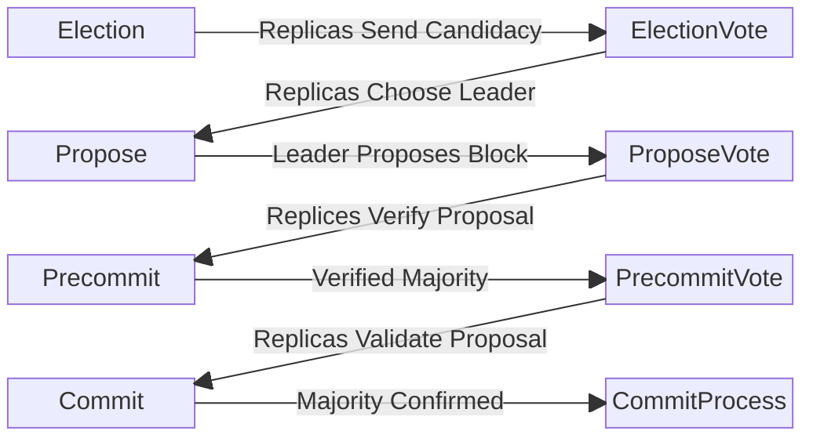

# BFT

`bft.go` contains the high level logic for Canopy's implementation of the Hotstuff BFT Consensus protocol. Canopy implements Hotstuff with these eight phases:

1. Election - Replicas gossip candidacy
2. ElectionVote - Replicas determine leader from candidates
3. Propose - Leader proposes block
4. ProposeVote - Replicas validate proposed block
5. Precommit - Leader reviews block validations
6. PrecommitVote - Replicas validate majority approved block
7. Commit - Leader verifies majority vote
8. CommitProcess - Replicas verify commit message and commit block

There are two other phases to handle errors and failure to achieve concensus:

1. RoundInterrupt - Entered on error or failure to reach consensus
2. Pacemaker - Ensures replicas are on the same round and restarts consensus process at Election

## Consensus Rounds

A consensus round begins at the Election phase and during normal operation, proceeds sequentially through each phase until the proposed block is commited during the final phase.


### Election Phase

The election phase serves to establish the set of validators that are eligible to be included in the election.

To do this, each validator performs the following steps:

1. Run the sortition process, using the following data points:
  - Last Proposer Addresses
  - Root Height
  - Height
  - Round
  - PrivateKey

    There are two important data points here:

    - Last Proposer Address is used to prevent the Leader from manipulating the election proces
    - The current round is used to ensure the output of the VRF is different so should one round fail to achieve consensus, the next round's election will likely result in a different leader.

2. Use sortition parameters to determine replica eligibility in election
3. If replica is eligible, sign components of the sortition data and send it to all replicas for the election vote phase

P2P: Eligible replicas gossip candidacy

### ElectionVote Phase

The election vote phase is where the next proposer is determined.

Each replica collects all candidate messages sent in the Election Phase and uses them to select the next proposer.

Once proposer is selected, the replica sends a message directly to that replica stating the local replica believes the remote replica to be the new proposer.

Output: Replicas send signed vote to proposer

### Propose Phase

The propose phase is where the proposer proposes the next block. This phase is only for the proposer.

When a proposal is created, a block is created along with a result containing the reward and slash recipients. Will use HighQC instead of creating another proposal.

A quorum certificate is created containing the block bytes and result data and sent in a message to all replicas.

Output: Proposal 

### ProposeVote Phase

Replica receives proposal from proposer
Checks for locked proposal, verifies safe node predicate if so
Validates proposal
Sends verified block hash and results hash back to proposer (the propose vote)

### Precommit Phase

Leader reviews collected replica propose votes
Verifies 2/3rd majority signatures by voting power
Send precommit message to replicas

### PrecommitVote Phase

Replicas review messages from the leader validating the 2/3rd signature
Replica locks the proposal
Replicas send signed (aggregable) propose vote to leader

### Commit Phase

Leader reviews collected precommit votes (votes signing off on validity of Leader's Proposal)
Verify 2/3rds signature
Send commit message with multisig to replicas

### Commit Process Phase

Replica reviews message from Leader by validating 2/3rds signature
Clears byzantine evidence
Gossip QC message to peers
This ends the block time

### Round Interrupt Phase

Should there be an unexpected error or condition during any other phases, the replicas will abandon the current phase, send a pacemaker message to all replicas, and enter a round interrupt phase.

When this happens, phase processing is halted the replica will idle until the final phase which will be replaced with the pacemaker phase.

Causes:
- ProposeVote phase didn't get a valid message from proposer
- ProposeVote HighQC but not SafeNode
- ProposeVote invalid proposal
- Precommit phase couldn't get majority vote
- PrecommitVote did not get a valid message from proposer
- PrecommitVote got invalid proposer or proposal
- CommitPhase couldn't get majority vote
- CommitProcess did not get a valid message from proposer
- CommitProcess got invalid proposer or proposal

### Pacemaker Phase

Replica examines all received pacemaker messages to find the highest round that majority has seen

# Phase Timings & Block Time

Phase lengths are defined in `config.json`:

```
  "electionTimeoutMS": 2000,
  "electionVoteTimeoutMS": 2000,
  "proposeTimeoutMS": 3000,
  "proposeVoteTimeoutMS": 3000,
  "precommitTimeoutMS": 2000,
  "precommitVoteTimeoutMS": 2000,
  "commitTimeoutMS": 2000,
  "commitProcessMS": 3000,
```

The last phase, `commitProcessMS` is the one to modify to modify total block time.

# Proposal Locking & Safe Node Predicate

During the precommit vote phase replicas will lock on a proposal.
This proposal has been verified by the leader as having the majority vote behind it.

Should a round interrupt occur, the consensus process will be reset to the election phase, with replicas retaining the locked proposal.

During the next propose phase this locked proposal will be used as the proposal which will be gossiped to replicas.

During the proposevote phase, the replicas will see they still have a locked proposal and will run the safe node predicate check to verify whether they can unlock

It is safe to unlock if:
- Block hash and Result hash for the locked proposal and received proposal are the same (SAFETY)
- The round in the received proposal is higher than the locked proposal (LIVENESS)


