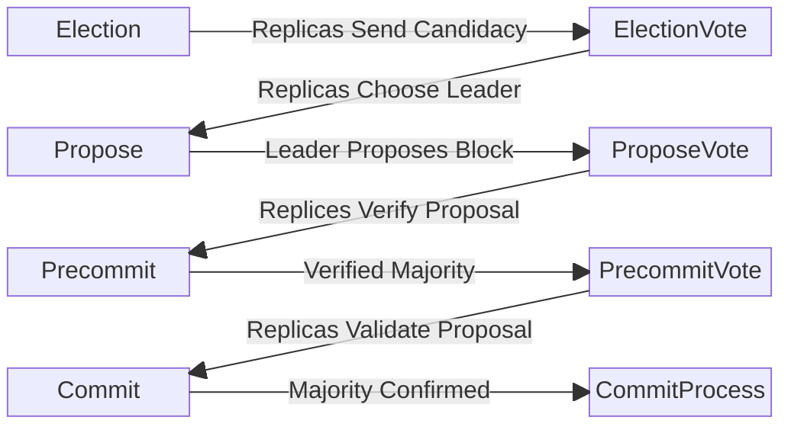

# BFT

`bft.go` contains the core logic for Canopy's implementation of the Hotstuff BFT Consensus protocol. Canopy implements Hotstuff with these eight phases:

1. Election: Replicas gossip candidacy
2. ElectionVote: Replicas select a leader from the pool of gossiped candidates
3. Propose: The elected leader puts forth a proposed block for consideration
4. ProposeVote: Replicas validate proposed block
5. Precommit: Leader reviews block validations received from replicas
6. PrecommitVote: Replicas validate the block that received majority approval
7. Commit: Leader verifies majority vote results
8. CommitProcess: Replicas validate majority signature and proceed to commit block

Additionally, there are two phases designed to address errors and failures when achieving consensus:

1. **RoundInterrupt**: This phase is activated in case of errors or if consensus
cannot be reached. The pacemaker phase follows.
2. **Pacemaker**: This mechanism ensures all replicas are synchronized to the same
round and initiates a restart of the consensus process beginning with the
Election phase.

## Consensus Phases & Rounds

A consensus round begins with the Election phase. During normal operations, this
round progresses sequentially through each phase until the proposed block is
successfully committed in the final phase.

If consensus is not achieved during a round, the round counter is incremented to
increase the chances of a successful outcome in the next attempt.

Incrementing the round counter helps in the following ways:

- If consensus failure is due to an issue with the elected leader, incrementing
  the round ensures that the Verifiable Random Function (VRF) output changes,
  increasing the likelihood of selecting a different leader in the subsequent
  round.
- In the case of consensus failure caused by asynchronous network issues,
  incrementing the round counter introduces backoff timing, which reduces the
  risk of repeated failures in successive rounds.

### Election Phase

The election phase serves to establish the set of validators that are eligible to participate in the leader election.

To do this each validator runs the sortition process, signing the VRF output and generating election elibility status.

The last proposer addresses and current round are used as input for the VRF function. Using thelat proposer address ensures the leaders cannot manipulate eligibility.

P2P: Eligible validators broadcast their candidacy to the replicas.

### ElectionVote Phase

The election vote phase is dedicated to selecting the next proposer from the
pool of eligible candidates.

During this phase, each replica evaluates the candidacy messages collected
during the Election Phase and chooses the candidate with the lowest VRF out
signature as the next leader.

P2P: Replicas send their signed vote to the chosen proposer, endorsing them as
the leader.

### Propose Phase

During this phase each replica checks to see if it was chosen as the proposer by the majority vote. The chosen replica then creates and proposes the next block.

When a proposal is created, a block is created along with a result containing the reward and slash recipients. Should a previously locked block exist, this one will be used as the proposed block.

P2P: A proposal containing the block and results are gossiped to replicas.

### ProposeVote Phase

In this phase, replicas receive and examine a proposal.

If there is a previously locked proposal, the replicas verify that the safe node
predicate has been met before unlocking and using the received proposal.

Replicas then validate the proposal, applying any double signing evidence.

P2P: Replica sends validated proposal back to proposer.

### Precommit Phase

In this phase the leader reviews the received replica proposal votes and verifies 2/3rd majority signatures by voting power

P2P: Leader sends precommit message to replicas

### PrecommitVote Phase

In this phase replicas review the precommit message from the leader and
validate the majority vote signature.

Replicas lock the proposal

P2P: Replicas send signed propose vote to leader

### Commit Phase

In the Commit phase, the leader examines the precommit votes it has received,
which confirm the validity of the leader’s proposal. The leader then verifies
that these precommit votes collectively contain signatures from at least
two-thirds of the replicas. Upon successful verification, the leader sends a
commit message, which includes a multisignature, to all replicas.

### Commit Process Phase

During the Commit Process phase, each replica reviews the commit message and
verifies it is the correct proposal and comes from the correct proposer.

Once verified, the block is commited and gossiped to replicas.

### Round Interrupt Phase

Should there be an unexpected error or condition during any other phases, the replicas will abandon the current phase, send a pacemaker message to all replicas, and enter a round interrupt phase.

When this happens, phase processing is halted the replica will idle until the final phase which will be replaced with the pacemaker phase.

Causes:
- ProposeVote phase didn't get a valid message from proposer

- ProposeVote invalid proposal
- Precommit phase couldn't get majority vote
- PrecommitVote did not get a valid message from proposer
- PrecommitVote got invalid proposer or proposal
- CommitPhase couldn't get majority vote
- CommitProcess did not get a valid message from proposer
- CommitProcess got invalid proposer or proposal

### Pacemaker Phase

Replica examines all received pacemaker messages to find the highest round that majority has seen

# Phase Timings & Block Time

Phase lengths are defined in `config.json`:

```
  "electionTimeoutMS": 2000,
  "electionVoteTimeoutMS": 2000,
  "proposeTimeoutMS": 3000,
  "proposeVoteTimeoutMS": 3000,
  "precommitTimeoutMS": 2000,
  "precommitVoteTimeoutMS": 2000,
  "commitTimeoutMS": 2000,
  "commitProcessMS": 3000,
```

The last phase, `commitProcessMS` is the one to modify to modify total block time.

# Proposal Locking & Safe Node Predicate

During the precommit vote phase replicas will lock on a proposal.
This proposal has been verified by the leader as having the majority vote behind it.

Should a round interrupt occur, the consensus process will be reset to the election phase, with replicas retaining the locked proposal.

During the next propose phase this locked proposal will be used as the proposal which will be gossiped to replicas.

During the proposevote phase, the replicas will see they still have a locked proposal and will run the safe node predicate check to verify whether they can unlock

It is safe to unlock if:
- Block hash and Result hash for the locked proposal and received proposal are the same (SAFETY)
- The round in the received proposal is higher than the locked proposal (LIVENESS)


