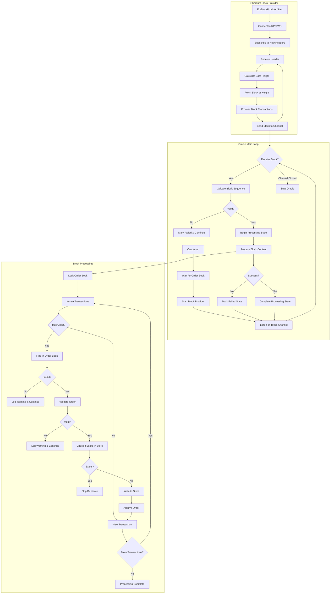
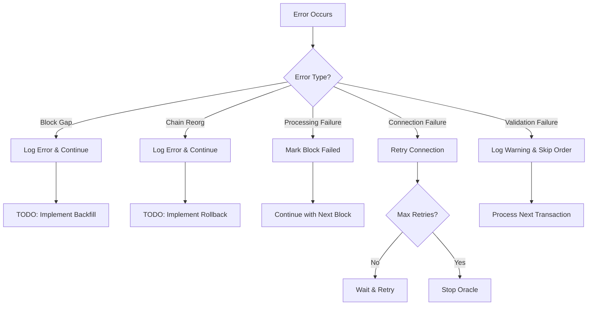

# Code Flow Analysis Report: Canopy Oracle System

## Flow Diagram



## Detailed Flow Analysis

### 1. Block Provider Flow (cmd/rpc/oracle/eth/block_provider.go)

**Entry Point**: `EthBlockProvider.Start()` at line 150

**Flow Steps**:
1. **Connection Establishment** (`connect()` at line 187):
   - Creates RPC client for fetching blocks
   - Creates WebSocket client for header subscription
   - Implements retry logic with configurable delay

2. **Header Monitoring** (`monitorHeaders()` at line 220):
   - Subscribes to new block headers via WebSocket
   - Processes headers as notifications of new blocks
   - Buffer size: 10 headers (`headerChannelBufferSize`)

3. **Safe Block Processing** (`processBlocks()` at line 260):
   - Calculates safe height: `safeHeight = currentHeight - confirmations`
   - Processes all blocks from `nextHeight` to `safeHeight`
   - Fetches block data via RPC (`fetchBlock()`)
   - Sends blocks through channel after processing

4. **Transaction Processing** (`processBlockTransactions()` at line 300):
   - Parses transaction data for Canopy orders
   - Validates transaction success via receipt
   - Fetches ERC20 token information for token transfers
   - Clears invalid orders from failed transactions

**Key Safety Mechanisms**:
- **Safe Height Confirmations**: Waits for configurable confirmations before processing
- **Transaction Receipt Validation**: Verifies transaction success before processing orders
- **Connection Recovery**: Automatic reconnection on RPC/WS failures
- **Atomic Block Processing**: Processes complete blocks sequentially

### 2. Oracle Main Processing Flow (cmd/rpc/oracle/oracle.go)

**Entry Point**: `Oracle.run()` at line 97

**Flow Steps**:
1. **Initialization** (lines 101-119):
   - Determines starting height from saved state
   - Waits for order book to be available
   - Sets block provider height and starts it

2. **Block Reception Loop** (lines 123-171):
   - Listens on block channel from provider
   - Handles graceful shutdown via context cancellation
   - Processes blocks through validation and content processing pipeline

3. **Block Validation** (`BlockStateManager.ValidateBlock()` at state.go:35):
   - **Gap Detection**: Ensures sequential block processing
   - **Reorg Detection**: Compares parent hash with previous block
   - **State Recovery**: Handles incomplete processing from previous runs

4. **Block Content Processing** (`processBlock()` at line 258):
   - Locks order book for thread-safe access
   - Iterates through all transactions in block
   - Validates each order against order book
   - Writes valid orders to persistent store

**Error Handling Strategy**:
- **Non-Fatal Errors**: Log warnings and continue processing
- **Fatal Errors**: Mark block as failed, continue with next block
- **State Persistence**: Two-phase commit for block processing state
- **Recovery**: Automatic retry of failed blocks on restart

### 3. Transaction Processing for Order Data

**Order Detection Flow** (eth/transaction.go:72):
1. **Self-Sent Transactions** (lines 82-101):
   - Transaction where `from == to`
   - Transaction data contains JSON lock order
   - Creates `WitnessedOrder` with `LockOrder`

2. **ERC20 Transfer Analysis** (lines 104-159):
   - Parses ERC20 transfer method signature (`a9059cbb`)
   - Extracts recipient, amount, and extra data
   - **Self-Sent ERC20 Lock**: `from == recipient && amount == 0`
   - **Close Order ERC20**: Regular ERC20 transfer with order data

**Validation Pipeline**:
- **JSON Schema Validation**: Orders validated against schema
- **Order Book Matching**: Orders must exist in current order book
- **Field Validation**: Lock/close order fields verified
- **Duplicate Prevention**: Existing orders in store are skipped

### 4. Height and Safe Height Usage

**Next Height Management**:
- **Initial Setting**: Oracle sets starting height on block provider
- **Sequential Processing**: `nextHeight` incremented after each block
- **Thread Safety**: Protected by `heightMu` mutex

**Safe Height Calculation** (block_provider.go:264):
```go
safeHeight = currentHeight - safeBlockConfirmations
```

**Safety Guarantees**:
- Only processes blocks with sufficient confirmations
- Prevents processing of potentially reorg'd blocks
- Configurable confirmation depth

**Gap Handling**:
- **Detection**: Expected height vs actual height comparison
- **Action**: Log error, mark as failed, continue processing
- **Recovery**: Manual restart required for gap resolution

### 5. Error Handling and Recovery Mechanisms



**Error Recovery Strategies**:

1. **Block Processing Errors**:
   - **Failed Transactions**: Skip invalid orders, continue processing
   - **Store Write Failures**: Return error, fail entire block
   - **Order Book Unavailable**: Wait with 1-second ticker

2. **Connection Errors**:
   - **RPC Failures**: Retry with exponential backoff
   - **WebSocket Disconnection**: Reconnect and resubscribe
   - **Timeout Handling**: 5-second timeout for transaction receipts

3. **State Recovery**:
   - **Incomplete Processing**: Retry failed blocks on restart
   - **Chain Reorganization**: Log error (TODO: implement rollback)
   - **Block Gaps**: Log error (TODO: implement backfill)

### 6. Oracle Methods Analysis

#### WitnessedOrders Method (oracle.go:520)

**Purpose**: Returns witnessed orders for block proposal

**Logic Flow**:
1. **Order Book Iteration**: Loops through all orders in order book
2. **Lock Order Processing** (unlocked sell orders):
   - Searches store for witnessed lock orders
   - Checks submission criteria via `shouldSubmit()`
   - Updates last submit height
   - Returns lock order for inclusion

3. **Close Order Processing** (locked sell orders):
   - Searches store for witnessed close orders  
   - Checks submission criteria
   - Updates last submit height
   - Returns order ID for inclusion

**Submission Control**:
- **Propose Lead Time**: Prevents immediate submission of new orders
- **Resubmit Delay**: Controls frequency of resubmissions
- **Height Tracking**: Prevents duplicate submissions

#### ValidateProposedOrders Method (oracle.go:334)

**Purpose**: Validates proposed orders against local store

**Validation Process**:
1. **Lock Order Validation** (lines 350-364):
   - Reads corresponding order from local store
   - Performs exact equality comparison
   - Returns error if not found or unequal

2. **Close Order Validation** (lines 366-386):
   - Constructs expected close order structure
   - Compares with stored witnessed order
   - Validates order ID and chain ID matching

**Security Features**:
- **Exact Matching**: Prevents malicious order modifications
- **Local Verification**: Only validates against locally witnessed orders
- **Immutability**: Orders cannot be altered after witnessing

#### shouldSubmit Method (oracle.go:493)

**Purpose**: Determines if witnessed order should be submitted

**Decision Criteria**:
1. **Propose Lead Time Check** (line 495):
   ```go
   if sourceChainHeight < order.WitnessedHeight + proposeLeadTime {
       return false
   }
   ```

2. **Resubmit Delay Check** (line 508):
   ```go
   if rootHeight <= order.LastSubmitHeight + orderResubmitDelay {
       return false
   }
   ```

**Rate Limiting Strategy**:
- **Lead Time**: Prevents immediate submission of fresh orders
- **Resubmit Delay**: Prevents spam submission of same order
- **Height Tracking**: Ensures proper timing across root chain heights

## Critical Findings

### 🔴 High Risk Issues

1. **Incomplete Error Recovery** - `oracle.go:144-147`
   - **Description**: Chain reorg and block gap detection exists but recovery is not implemented
   - **Impact**: Oracle may become stuck on chain reorganizations or missing blocks
   - **Exploitation**: Could cause oracle to fall behind or process invalid data
   - **Mitigation**: Implement automatic rollback for reorgs and backfill for gaps

2. **Order Book Race Condition** - `oracle.go:277-280`
   - **Description**: Order book can become nil during processing despite earlier check
   - **Impact**: Potential nil pointer dereference
   - **Exploitation**: Could crash oracle during order book updates
   - **Mitigation**: Add additional nil checks or use immutable copies

### 🟡 Medium Risk Issues

1. **Debug Print Statements** - `eth/transaction.go:118-119`
   - **Description**: Debug print statements left in production code
   - **Impact**: Information leakage and performance impact
   - **Recommendation**: Remove debug statements before production

2. **Limited Retry Logic** - `block_provider.go:166-175`
   - **Description**: No maximum retry limit for connection failures
   - **Impact**: Potential infinite retry loops consuming resources
   - **Recommendation**: Implement exponential backoff with maximum attempts

### 🟢 Low Risk Issues

1. **TODO Comments** - Multiple locations
   - **Description**: Several TODO comments indicate incomplete features
   - **Recommendation**: Address TODOs or document as future enhancements

## Security Safeguards Analysis

### Input Validation
- **JSON Schema Validation**: All order data validated against schemas
- **Transaction Receipt Verification**: Only successful transactions processed
- **Order Book Matching**: Orders must exist in root chain order book
- **Field Validation**: Comprehensive validation of order fields

### State Integrity
- **Two-Phase Commit**: Block processing uses atomic state updates
- **Gap Detection**: Sequential block processing enforced
- **Reorg Detection**: Parent hash verification prevents invalid chains
- **Duplicate Prevention**: Existing orders not overwritten

### Resource Protection
- **Connection Timeouts**: 5-second timeout for transaction receipts
- **Channel Buffering**: Limited buffer sizes prevent memory exhaustion
- **Graceful Shutdown**: Context-based cancellation throughout

### Data Consistency
- **Thread Safety**: Mutex protection for shared state
- **Atomic File Operations**: State files written atomically
- **Archive Storage**: Orders archived for historical retention

## Architecture Assessment

### Design Patterns
- **Observer Pattern**: Block provider notifies oracle of new blocks
- **Strategy Pattern**: Pluggable block providers and order stores
- **State Machine**: Clear processing states with transitions

### Separation of Concerns
- **Layer Boundaries**: Clear separation between Ethereum, Oracle, and Storage
- **Interface Abstraction**: Well-defined interfaces for components
- **Error Isolation**: Component failures don't cascade

### Extension Points
- **Multi-Chain Support**: Generic interfaces support multiple blockchains
- **Configurable Parameters**: Timeouts, confirmations, delays configurable
- **Plugin Architecture**: Order validators and stores are pluggable

## Recommendations

### Security Improvements
1. **Implement Chain Reorg Recovery**: Add automatic rollback and reprocessing
2. **Add Block Gap Backfill**: Implement missing block recovery mechanism
3. **Enhance Error Boundaries**: Improve error isolation and recovery
4. **Add Rate Limiting**: Implement submission rate limits per validator

### Logic & Code Quality
1. **Remove Debug Code**: Clean up debug print statements
2. **Add Comprehensive Logging**: Improve observability without debug prints
3. **Implement Graceful Degradation**: Better handling of partial failures
4. **Add Metrics and Monitoring**: Implement comprehensive health checks

### Performance Optimizations
1. **Implement Connection Pooling**: Reduce RPC connection overhead
2. **Add Batch Processing**: Process multiple orders in single operations
3. **Optimize State Persistence**: Reduce disk I/O frequency
4. **Implement Caching**: Cache frequently accessed order book data

## Testing Recommendations

### Unit Tests Needed
- [ ] Test chain reorganization detection and recovery
- [ ] Test block gap detection and handling
- [ ] Test order validation edge cases
- [ ] Test concurrent order book updates

### Integration Tests Needed
- [ ] Test complete order flow from Ethereum to Canopy
- [ ] Test error recovery across component boundaries
- [ ] Test graceful shutdown and restart scenarios

### Security Tests Needed
- [ ] Test malicious order submission attempts
- [ ] Test resource exhaustion scenarios
- [ ] Test data integrity across failures

## Conclusion

**Overall Assessment**: The oracle system demonstrates a solid architecture with comprehensive validation and state management. The code shows defensive programming practices with extensive error handling and logging. However, some critical recovery mechanisms are not yet implemented.

**Priority Actions**: 
1. Implement chain reorganization recovery mechanism
2. Add block gap backfill functionality  
3. Remove debug print statements
4. Add comprehensive monitoring and alerting

**Long-term Improvements**: The system would benefit from enhanced observability, performance optimizations, and more sophisticated error recovery strategies to handle edge cases in production environments.