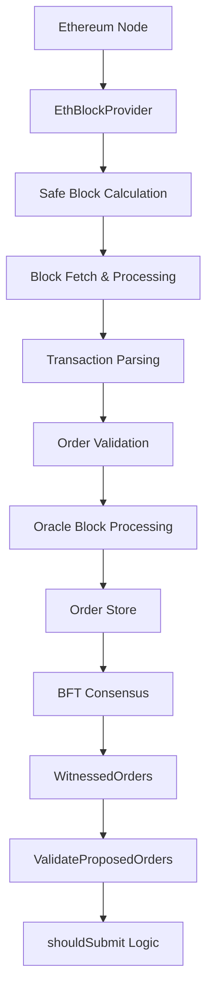
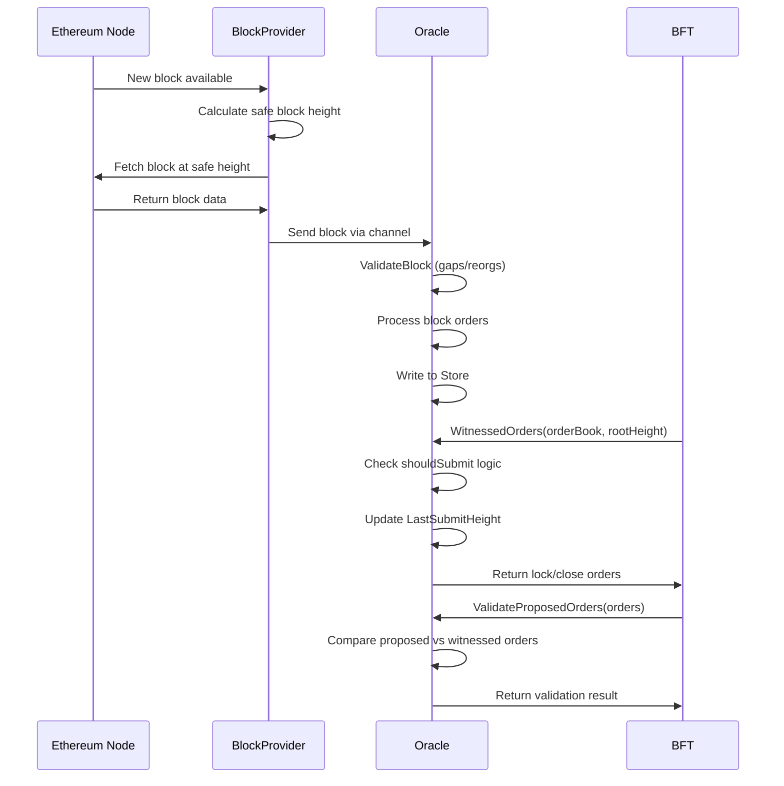

# Oracle Flow Analysis Report

## Overview

The Canopy Oracle system is a cross-chain bridge that monitors Ethereum blockchain for Canopy-related transactions (lock/close orders) and integrates them into the Canopy nested chain through BFT consensus. This analysis examines the complete flow from Ethereum block reception to order validation and submission.

## Flow Diagram

## Detailed Component Analysis

### 1. Ethereum Block Provider (`cmd/rpc/oracle/eth/`)

#### Block Reception Flow
The EthBlockProvider manages the connection to Ethereum and provides safe blocks through a robust pipeline:

**Process Flow:**
1. **WebSocket Subscription**: `monitorHeaders()` subscribes to new block headers
2. **Safe Height Calculation**: Each header triggers `processBlocks()` which calculates `safe height = current height - confirmations`
3. **Sequential Processing**: Processes all blocks from `nextHeight` to `safeHeight` sequentially
4. **Block Fetching**: `fetchBlock()` retrieves full block data via RPC
5. **Transaction Processing**: `processBlockTransactions()` validates and processes each transaction

**Key Safety Mechanisms:**
- **Safe Block Confirmations**: Only processes blocks after N confirmations (configurable)
- **Sequential Processing**: Blocks are processed in strict order to prevent gaps
- **Transaction Success Verification**: Checks transaction receipts to ensure token transfers actually succeeded
- **Connection Resilience**: Automatic reconnection on RPC/WebSocket failures with exponential backoff
- **Order Validation**: All orders are validated before processing using `OrderValidator`

#### Transaction Parsing (`transaction.go`)
The system parses transactions looking for Canopy orders:

**Lock Orders:**
- Self-sent transactions with lock order JSON in transaction data
- ERC20 transfers to self with 0 value and lock order JSON in extra data

**Close Orders:**
- ERC20 transfers with close order JSON in extra data
- Validates actual token transfer occurred

**Safety Features:**
- Strict ERC20 transfer format validation
- JSON schema validation for orders
- Transaction success verification via receipts
- Token info caching to prevent repeated RPC calls

### 2. Oracle Block Processing (`oracle.go`)

#### Main Processing Loop
The Oracle's `run()` method implements a robust block processing pipeline:

**Flow:**
1. **Initialization**: Waits for order book from root chain before accepting blocks
2. **Height Recovery**: Uses `BlockStateManager` to determine starting height
3. **Block Reception**: Receives blocks from from the block provider via the `blockCh` channel
4. **Two-Phase Processing**: 
   - Phase 1: `BeginProcessing()` - marks block as being processed
   - Phase 2: `CompleteProcessing()` or `FailProcessing()` - finalizes state

**Key Safety Mechanisms:**
- **Block Validation**: `ValidateBlock()` checks for gaps and reorganizations
- **State Persistence**: All processing states saved to disk for recovery
- **Gap Detection**: Ensures no blocks are skipped in sequence
- **Reorg Detection**: Compares parent hashes to detect chain reorganizations
- **Recovery Logic**: Can resume from any interrupted state on restart
- **Order Book Dependency**: Waits for valid order book before processing

#### Block Processing (`processBlock()`)
Processes individual blocks and their transactions:

**Process:**
1. **Order Extraction**: Gets witnessed orders from each transaction
2. **Order Book Lookup**: Validates orders exist in the root chain order book
3. **Order Validation**: Ensures witnessed orders match order book entries
4. **Deduplication**: Prevents duplicate orders from being stored
5. **Persistence**: Writes validated orders to order store and archive

**Key Safety Mechanisms:**
- **Order Book Validation**: Orders must exist in root chain order book
- **Strict Matching**: Witnessed orders must exactly match order book entries
- **Duplicate Prevention**: Existing orders are not overwritten
- **Transaction Validation**: Failed transactions are ignored
- **Atomic Operations**: Order writing operations are atomic

### 3. WitnessedOrders Method

#### Purpose
Returns witnessed orders that should be included in the next block proposal. Called by the BFT consensus when the elected leader is building a block proposal.

**Process Flow:**
1. **Order Book Iteration**: Scans through all orders in the root chain order book
2. **Lock Order Processing**: For unlocked sell orders, looks for witnessed lock orders
3. **Close Order Processing**: For locked orders, looks for witnessed close orders
4. **Submission Logic**: Uses `shouldSubmit()` to determine if order should be included
5. **State Update**: Updates last submission height to allow for resubmit delays

**Key Safety Mechanisms:**
- **Order Book Synchronization**: Only processes orders present in current order book
- **Submission Throttling**: `shouldSubmit()` prevents rapid resubmission
- **Lead Time Protection**: Orders must wait minimum time before first submission
- **Resubmit Delay**: Orders have delay before resubmission to allow for root chain processing time

### 4. ValidateProposedOrders Method

#### Purpose
Validates that all orders in a proposed block are present in the local order store. Called during BFT consensus validation phase.

**Process Flow:**
1. **Order Enumeration**: Processes both lock and close orders in the proposal
2. **Store Lookup**: Retrieves each order from the local witnessed order store
3. **Exact Matching**: Compares proposed orders byte-for-byte with stored orders
4. **Validation Result**: Returns error if any order fails validation

**Key Safety Mechanisms:**
- **Exact Matching**: Orders must be identical to witnessed orders
- **Complete Validation**: All orders in proposal must be validated
- **Store Consistency**: Ensures local store has all required orders
- **Defensive Coding**: Handles nil cases and missing orders gracefully

### 5. shouldSubmit Method

#### Purpose
Determines whether a witnessed order should be submitted based on timing and submission history.

**Logic Flow:**
1. **Lead Time Check**: Order must wait `proposeLeadTime` external chain blocks after being witnessed
2. **Resubmit Delay**: Must wait `orderResubmitDelay` blocks since last submission
3. **Height Comparison**: Uses source chain height for lead time, root chain height for resubmit delay

**Key Safety Mechanisms:**
- **Lead Time Protection**: Prevents immediate submission of newly witnessed orders
- **Resubmit Throttling**: Prevents spam by limiting resubmission frequency
- **Height Tracking**: Separate tracking for source chain vs root chain heights
- **Submission History**: Tracks when orders were last submitted

## Critical Safety Analysis

### Block Missing Prevention

**Question**: Is it possible to miss blocks?

**Analysis**: The system has multiple layers of protection against missing blocks:

1. **Sequential Processing**: Blocks are processed in strict sequential order
2. **Gap Detection**: `BlockStateManager.ValidateBlock()` detects if any blocks are skipped
3. **Safe Block Confirmations**: Only processes blocks after N confirmations
4. **State Persistence**: Processing state is saved to disk for recovery
5. **Recovery Logic**: Can detect and retry processing from any interruption point

### Token Transfer Missing Prevention

**Question**: Is it possible to miss token transfers?

**Analysis**: Multiple safeguards prevent missing valid token transfers:

1. **Complete Transaction Processing**: All transactions in each block are examined
2. **ERC20 Format Validation**: Strict parsing of ERC20 transfer format
3. **Transaction Success Verification**: Checks transaction receipts to confirm success
4. **Order Validation**: Orders must exist in root chain order book
5. **Deduplication Logic**: Prevents processing same order twice

**Potential Issues:**
- Non-standard ERC20 implementations might not be detected
- Receipt fetching failures could cause valid transfers to be ignored
- Order book synchronization delays could cause temporary misses

**Mitigation**: Conservative approach - better to miss invalid transfers than process invalid ones.

## Key Safety Mechanisms Summary

### Block Provider Safety
- ✅ Safe block confirmations prevent processing reorged blocks
- ✅ Sequential height processing prevents gaps
- ✅ Connection resilience with automatic reconnection
- ✅ Transaction success verification prevents processing failed transactions
- ✅ Order validation before processing

### Oracle Processing Safety
- ✅ Two-phase block processing with state persistence
- ✅ Gap and reorganization detection
- ✅ Recovery from interrupted processing
- ✅ Order book validation before processing orders
- ✅ Duplicate order prevention
- ✅ Atomic order storage operations

### Consensus Integration Safety
- ✅ Exact order matching in validation
- ✅ Lead time protection for new orders
- ✅ Complete proposal validation
- ✅ Error handling with clear diagnostics

### State Management Safety
- ✅ Atomic file operations for state persistence
- ✅ Temporary file usage to prevent corruption
- ✅ Recovery from any processing state
- ✅ Chain continuity verification
- ✅ Retry logic for failed operations

## Recommendations

### High Priority
1. **Implement Automatic Backfill**: Add logic to automatically request missing blocks when gaps are detected
2. **Add Chain Reorg Recovery**: Implement automatic rollback and reprocessing from fork points
3. **Enhance Error Recovery**: Add more sophisticated retry logic for transient failures

### Medium Priority
1. **Monitoring and Alerting**: Add metrics for block processing latency and error rates
2. **Configuration Validation**: Validate all configuration parameters on startup
3. **Performance Optimization**: Consider parallel processing of transactions within blocks

### Low Priority
1. **Enhanced Logging**: Add structured logging with correlation IDs
2. **Health Checks**: Add endpoint to verify oracle health and synchronization status
3. **Graceful Shutdown**: Implement proper cleanup on shutdown signals

## Conclusion

The Oracle system implements a robust and safety-focused architecture for cross-chain order processing. The multiple layers of validation, state persistence, and error detection provide strong guarantees against missing blocks or token transfers. While there are some edge cases around chain reorganizations and connection failures, the conservative approach ensures system integrity is maintained.

The two-phase processing, comprehensive state management, and strict validation make the system resilient to failures and restarts. The integration with BFT consensus through `WitnessedOrders` and `ValidateProposedOrders` provides additional safety through distributed validation.

