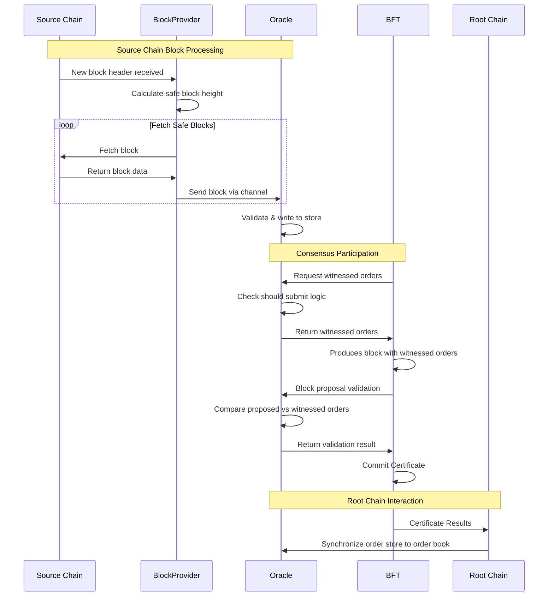

# Oracle Package

## Multi-Oracle Consensus with Validator Voting

The Oracle package provides cross-chain transaction witnessing and validation capabilities for the Canopy blockchain. It implements a chain-agnostic oracle that coordinates between source blockchains (like Ethereum) and a Canopy nested chain (observer chain) running this software to facilitate cross-chain order execution and validation.

The Canopy oracle nested chain employs a witness-based consensus mechanism that combines independent validator nodes with the NestBFT consensus algorithm to ensure reliable attestation of external blockchain transactions.

Each validator node in the committee independently monitors external chains (such as Ethereum) through configurable block providers and witnesses lock/close order transactions. When a relevant transaction is detected, oracle nodes validate it against the current order book and stores any witnessed orders locally.

They participate in the NestBFT consensus protocol where witnessed orders are proposed in blocks and validated against each nodes' witnessed orders. Thie ensures that the required +2/3 supermajority agreement among participating validators before any witnessed order is finalized on the observer chain and reported to the root chain.

## Overview

The Oracle package is designed to handle:
- Witnessing transactions on external blockchains containing Canopy lock & close orders
- Validating and storing witnessed orders in a local order store
- Participating in the BFT consensus process by providing witnessed orders for block proposals
- Synchronizing with the root chain order book to maintain consistency
- Managing persistent state for reliable order processing

## Core Components

### Oracle

The core of the Canopy Oracle system. It manages the overall cross-chain witnessing process, including:
- Receiving blocks from block providers
- Validating witnessed orders against the root chain order book
- Persisting witnessed orders to local storage
- Coordinating with the BFT consensus mechanism
- Maintaining synchronization with root chain order book state

# BlockProvider Integration

The Oracle integrates with external block providers through the `BlockProvider` interface. It provides:
- Real-time block monitoring from external chains
- Transaction parsing and order extraction
- Integration with Oracle's state management for gap detection and reorg handling

# Order Store Management

The Oracle manages witnessed orders through a persistent store that:
- Stores validated lock and close orders separately by type
- Provides atomic read/write operations for order data
- Maintains submission history with timestamps for resubmission logic
- Supports cleanup operations based on root chain order book updates
- Archives processed orders for audit and recovery purposes

## Sequence Diagram

The following sequence diagram illustrates the core interactions in the Oracle package:

## Technical Details

### Cross-Chain Transaction Witnessing

The Oracle system uses a block-based monitoring approach to witness transactions on external chains. This is achieved by:

- **Block Provider Integration**: Connects to external blockchain nodes through configurable providers
- **Transaction Parsing**: Extracts Canopy-specific order data from external chain transactions
- **Order Validation**: Performs comprehensive validation against root chain order book data
- **State Persistence**: Maintains reliable state storage for witnessed orders and processing height

The system works like a specialized blockchain monitor that specifically looks for transactions containing Canopy order data, validates them against known orders, and stores them for later use in the consensus process.

State persistence ensures that the Oracle can recover from interruptions without losing witnessed orders or reprocessing previously seen blocks.

# BFT Consensus Integration

The Oracle system uses a dual-phase approach to participate in Byzantine Fault Tolerant consensus:

1. **Proposal Phase**: When acting as a proposer, the Oracle queries its witnessed order store to find orders that should be included in the next block proposal
2. **Validation Phase**: When validating block proposals from other nodes, the Oracle verifies that all proposed orders exist in its local witnessed order store

This ensures that only orders witnessed by a majority of validator nodes are included in the blockchain, providing strong guarantees about cross-chain transaction validity.

### Order Book Synchronization

The Oracle system implements several synchronization mechanisms to maintain consistency with the root chain:

- **Order Book Updates**: Receives periodic updates of the complete root chain order book state
- **Stale Order Cleanup**: Automatically removes witnessed orders that are no longer relevant (locked orders, completed orders)
- **State Validation**: Ensures witnessed orders match current order book entries before including them in block proposals

This synchronization acts like a cache invalidation system, where the Oracle maintains local copies of relevant data but periodically synchronizes with the authoritative root chain state.

## Component Interactions

### 1. Block Processing: External Chain Monitoring

When a new block arrives from an external blockchain, the Oracle performs the following:

- **Block Reception**: Receives blocks through a channel-based interface from the configured BlockProvider
- **Height Persistence**: Saves the current block height to disk before processing to enable recovery
- **Transaction Analysis**: Examines each transaction in the block for Canopy-specific order data
- **Order Validation**: Validates witnessed orders against the current root chain order book
- **Storage Operations**: Persists valid orders to the local order store with appropriate metadata

This process is similar to how a blockchain indexer works, but with specific focus on cross-chain order validation and storage.

### 2. Consensus Participation: BFT Integration

The Oracle participates in the BFT consensus process through two key interfaces:

- **WitnessedOrders**: Called during block proposal to provide witnessed orders that should be included in the next block
- **ValidateProposedOrders**: Called during block validation to verify that proposed orders were actually witnessed by this node

This is analogous to how a validator node participates in consensus, but with specialized logic for cross-chain order validation.

## Configuration

The Oracle system utilizes two primary configuration structures defined in `lib/config.go` that control both Ethereum block monitoring and Oracle consensus behavior. These configurations provide comprehensive safety mechanisms and integrity measures for cross-chain transaction witnessing.

### EthBlockProviderConfig

Controls how the Oracle connects to and monitors Ethereum blockchain for order transactions (`lib/config.go:288-311`):

- **`NodeUrl`** (string): Ethereum RPC node URL for fetching blocks and transaction receipts. Used by the RPC client for all read operations including block retrieval and transaction validation.
- **`NodeWSUrl`** (string): Ethereum WebSocket URL for real-time block header notifications. Enables efficient block monitoring by subscribing to new block events.
- **`EVMChainId`** (uint64): Ethereum chain ID for transaction signature validation. Ensures transaction sender addresses are correctly extracted using the appropriate chain-specific signer.
- **`RetryDelay`** (int): Connection retry delay in seconds for RPC/WebSocket failures. Prevents rapid reconnection attempts that could overwhelm nodes during network issues.
- **`SafeBlockConfirmations`** (int): Number of block confirmations required before processing. Provides protection against chain reorganizations by only processing blocks that are unlikely to be reverted.
- **`StartupBlockDepth`** (uint64): How far back to start processing when no previous height is available. Ensures the Oracle can catch recently witnessed orders after restarts.

### OracleConfig  

Controls the Oracle's consensus participation and order submission behavior (`lib/config.go:313-332`):

- **`StateFile`** (string): Filename for persisting Oracle processing state. Enables recovery of the last processed block height and hash for gap detection and chain reorganization handling.
- **`OrderResubmitDelay`** (uint64): Number of root chain blocks to wait before resubmitting an order. Prevents duplicate submissions.
- **`Committee`** (uint64): Committee identifier this Oracle witnesses orders for. Must match the target committee in the root chain order book for proper order validation.
- **`ProposeLeadTime`** (uint64): Number of source chain blocks to wait before including newly witnessed orders in proposals. This allows a small amount of time for other validators to receive eth blocks should they be behind.
- **`ErrorReprocessDepth`** (uint64): How far back to reprocess blocks when sequence errors are detected. Enables recovery from chain reorganizations and missed blocks.
- **`LockOrderHoldTime`** (uint64): Number of root blocks to prevent resubmission of lock orders with the same ID. Prevents duplicate lock order submissions and potential double-spending.

## Key Safety Mechanisms

### cmd/rpc/oracle/eth Package Safety Mechanisms

- **Safe Block Processing**: Uses configurable confirmations (`SafeBlockConfirmations`) to only process blocks unlikely to be reorganized
- **Transaction Receipt Validation**: Verifies ERC20 transactions were successful on-chain before processing orders to prevent failed transaction exploitation
- **Connection Resilience**: Automatic retry logic with exponential backoff for RPC/WebSocket connection failures
- **Concurrent Processing Protection**: Unbuffered channels ensure block processing doesn't outpace consumer capacity
- **ERC20 Transfer Validation**: Strict parsing of transfer function calls with amount and recipient validation
- **Order Data Validation**: Multiple validation layers for lock/close order JSON parsing and structure verification
- **Height Synchronization**: Atomic height management with mutex protection for concurrent access safety

### cmd/rpc/oracle/oracle.go Safety Mechanisms

- **Order Book Synchronization**: Waits for valid order book before processing to prevent validation against stale data
- **Comprehensive Order Validation**: Multi-layer validation including ID matching, committee verification, and amount validation
- **State Persistence**: Atomic state saves after successful block processing for crash recovery
- **Gap Detection**: Validates sequential block processing to detect missed blocks or chain reorganizations
- **Duplicate Prevention**: Checks for existing orders in store before writing to prevent overwriting
- **Lock/Close Order Segregation**: Separate handling and validation logic for different order types
- **Order Book Matching**: Validates witnessed orders against current root chain order book state
- **Graceful Shutdown**: Context-based cancellation for clean Oracle shutdown
- **Error Isolation**: Individual transaction processing errors don't halt entire block processing

### cmd/rpc/oracle/state.go Safety Mechanisms

- **Lead Time Enforcement**: Ensures sufficient confirmations have passed before submitting orders (`ProposeLeadTime`)
- **Resubmission Control**: Prevents rapid resubmission of orders using configurable delays (`OrderResubmitDelay`) 
- **Lock Order Protection**: Special time-based restrictions for lock orders to prevent duplicate submissions (`LockOrderHoldTime`)
- **Submission History Tracking**: Maintains in-memory record of order submissions to prevent duplicates within the same proposal
- **Chain Reorganization Detection**: Validates parent hash continuity to detect chain reorgs
- **Atomic State Persistence**: Write-and-move pattern for crash-safe state file updates
- **Gap Detection**: Sequential height validation to identify missed blocks or processing errors
- **Recovery Support**: Comprehensive state recovery from disk for reliable Oracle restarts

